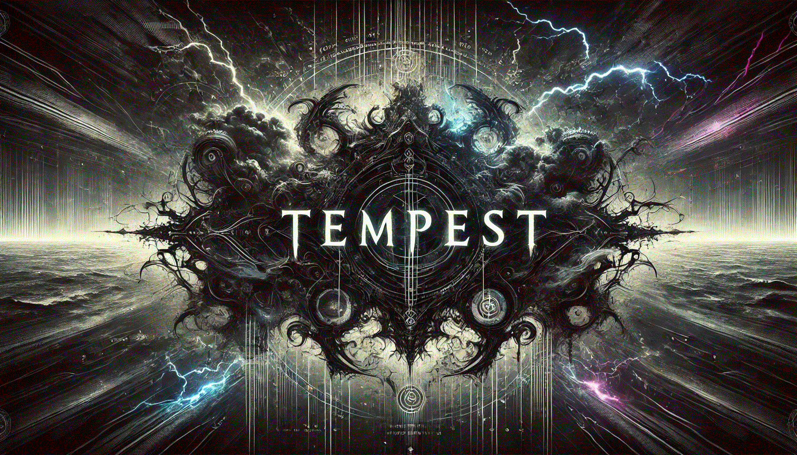

# Tempest

Tempest is a command and control framework written in 100% Rust.

*This is a research command and control framework.* What I mean by this, is that it is meant for research purposes. It is not meant to fully replace cobalt strike and all your other c2s for production ops. When I decided to write this project, I did so for a learning experience. I wanted to sit and try to plan out the design, and run into all the pitfalls along the way and have to solve them for myself. As the project has matured, I have begun to implement other tools or techniques from various other malware authors. I will try to always cite the original sources, the best that I can. If you notice any lack of attribution, please bring it to my attention so that I can add the credit, as it should be. Sometimes I cannot always find the original source, in which cases, I have specified that as well.

Because this is a research c2, the project moves at a slower pace and runs into a lot of issues along the way. So please understand that this is why. What I suggest for how to use this project, is to fork it, modify it, make it your own. Even better, write your own from scratch, using this code as a reference. Read the code, learn the particular techniques, the "why" of certain design decisions, and make your own c2. That's really the point and in my opinion, the most effective use of this framework.

##### Check the 'SetupGuide.md' for quick setup (TODO)
The setup guide is being rewritten for public release.
For now, the Anvil server has a README that will help you get started standing up the server. With the server built, you 'cargo build --release' conduit, connect to Anvil, and use the build function to build implants. 
More documentation is on the way.

Now I will provide a bit of a roadmap and current architecture.

##### Current Tech Stack: (100% Rust)

1. Server: **Anvil**
   
   - actix.rs & tokio
   - https
   - api for imps (implants)
   - api for conduit (hacker TUI client)
   - internal functions (implant builder + shellcode generation)
   - sqlite db (rusqlite)

2. Implant: **Imp**
   
   - platform-specific imps (windows, linux, mac)
   - payload options as executable, dll, or shellcode (shellcode - windows only)
   - simple, yet effective design
   - designed with OPSEC in mind. no post-ex module bloat
   - modular builds, moving toward giving operators control over granular options

3. TUI Client: **conduit**
   
   - main way of interacting with the server
   - Terminal User Interface (TUI) with realtime dashboard display
   - user friendly
   - cross-platform
   - looks cool to your old hacker friends
   - scrollable fields (PgUp + PgDn on implants field. Up + Down for output field)

AI modules - TBD

##### Roadmap

- harden auth between conduit client and anvil server (SSH key auth over TLS in dev)
- additional protocols for communications between server and implants (websockets in dev)
- peer to peer communications for implants over additional protocols
- enhanced socks proxy and multiplayer sessions handling
- templated implant builds with modular options
- evasion for linux and mac implants
- ~~- Python loader - Using a novel technique, load ANY python script and execute it on the target implant, using a signed and trusted python package.~~ I finished this but I'm not sure of the actual utility. I will likely release it as a seperate library.
- ~~- lua script loader - load lua script and execute in memory on target implant.~~ same comment as above
- process injections - 1 custom injection I wrote based on a combination and modification of existing techniques, so far released. more to come.
- ~~- COFF loader - load and execute COFF or BOFF files~~ opted for 3rd party library. See cofldr module for more information.
- ~~Chrome browser session hijacker extension~~ this got patched :(
- custom credential harvesting. *in progress. early PoCs complete. will add*
- AI support modules
- proxy. opted for 3rd party library. See socks module for more information.
- logging for command and output history (conduit side). 
- add a non-default option, to start an http server instead https (anvil for imps), so that the server can just let something like cloudflare handle the TLS and certs

##### CREDITS (direct code contributions)
- BOF Loader: https://github.com/Teach2Breach/coffee.git credits: hakaioffsec
- SOCKS proxy: https://github.com/Teach2Breach/rustpivotclient.git credits: deadjakk
- Runpe: https://github.com/yamakadi/clroxide credits: yamakadi
- Sleep Obfuscation: https://github.com/Teach2Breach/rekkoex credits: c5pider, trickster0
- Inject: https://github.com/FuzzySecurity/Sharp-Suite/blob/master/UrbanBishop credits: FuzzySecurity

Anybody I missed, please ping me to be added to credits

##### CREDITS (inspiration / education)
- 5pider (@C5pider) 
- Austin Hudson (ilove2pwn_)
- Trickster0 (@trickster012)
- memN0ps (@memN0ps)
- Kudaes (@_Kudaes_)
- Postrequest (link)
- 2vg (Blackcat-rs)
- TrustedSec && @HackingLZ
- Raphael Mudge (Red Team ops w/ Cobalt Strike)
