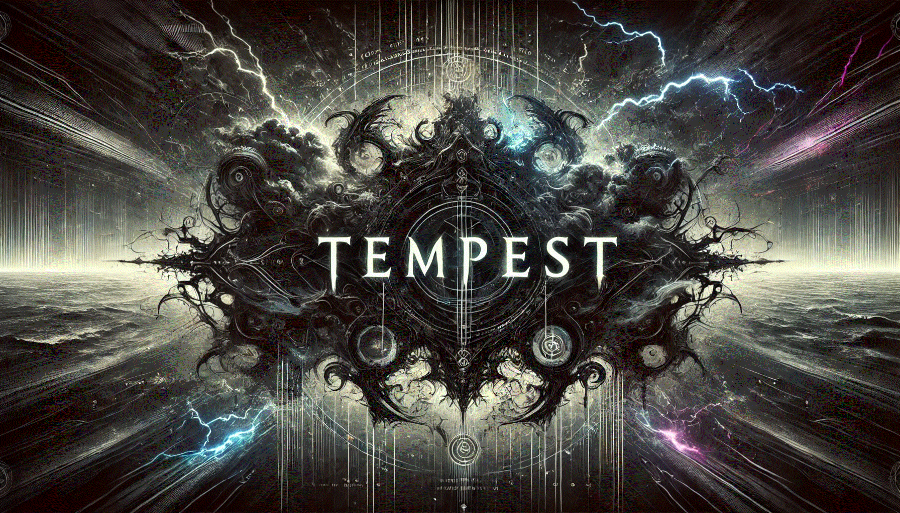

# Tempest



Tempest is a command and control framework written in 100% Rust.

blog post: https://teach2breach.io/tempest-intro/ <BR>
slides: https://teach2breach.io/defcon/TEMPEST.pptx  <BR>
virtual talk (youtube): https://www.youtube.com/watch?v=t5MSLPRNXMY <BR>
virtual talk on X: https://x.com/Teach2Breach/status/1826307718690320692/video/1 <BR>

*For the latest updates and coming update news, see the devlog.md in this repo*

*This is a research command and control framework.* What I mean by this, is that it is meant for research purposes. It is not meant to fully replace cobalt strike and all your other c2s for production ops. When I decided to write this project, I did so for a learning experience. I wanted to sit and try to plan out the design, and run into all the pitfalls along the way and have to solve them for myself. As the project has matured, I have begun to implement other tools or techniques from various other malware authors. I will try to always cite the original sources, the best that I can. If you notice any lack of attribution, please bring it to my attention so that I can add the credit. Sometimes I cannot always find the original source, in which cases, I have specified that as well.

Because this is a research c2, the project moves at a slower pace and runs into a lot of issues along the way. So please understand that this is why. What I suggest for how to use this project, is to fork it, modify it, make it your own. Even better, write your own from scratch, using this code as a reference. Read the code, learn the particular techniques, the "why" of certain design decisions, and make your own c2. That's really the point and in my opinion, the most effective use of this framework.

##### known issues
- sometimes the conduit client will not display output from the implants. I am working on a fix for this, but in the meantime, if you are not getting output, try restarting your conduit client. Upon reconnecting, it should display all the output from the previous session.
- see the devlog for more details on current issues and features in development

##### Check the 'SetupGuide.md' for quick setup (TODO)
The setup guide is being rewritten for public release.
For now, the Anvil server has a README that will help you get started standing up the server. With the server built, build **`conduit_gui`** (`cargo build --release` in `conduit_gui/`) as the **primary** operator client, connect to Anvil, and use the build flow to build implants. The **TUI** client in **`conduit/`** is **deprecated**; it remains in-tree for now but is not the focus. More documentation is on the way.

**Build note (IDE / rustup):** If `cargo` reports `error: unknown proxy name: 'Cursor'`, use the project helper so the real toolchain is invoked: `./scripts/cargo-ide.sh build --release` (see `scripts/cargo-ide.sh`).

**Linux system packages (operator GUI):** The Dioxus desktop app (`conduit_gui/`) needs **WebKitGTK 4.1**, **GTK3**, and related `pkg-config` libraries to link. **Authoritative list:** [`conduit_gui/README.md`](conduit_gui/README.md) — copy-paste `apt` / `dnf` / `pacman` install commands, plus notes on what each group is for. A shorter “how to build” page that points here is **[`docs/BUILDING.md`](docs/BUILDING.md)**. The server (`Anvil/`) and legacy TUI (`conduit/`) do not need that stack; a normal Rust install plus `libssl-dev` (Debian) is usually enough for those.

## Automated tests

From `Anvil/` (Linux; install `libssl-dev`, `pkg-config`, and `mingw-w64` for full coverage):

```bash
cargo test
```

| Test suite | Covers |
|------------|--------|
| `wire_protocol` | Encrypted implant `POST /js` registration, `/index` sleep update, operator `/imps` |
| `authenticate` | Operator Basic auth |
| `build_win_stargate` | MinGW `make exe` and `POST /build_imp` (skipped if MinGW missing) |

**Windows E2E** (real `beacon.exe` check-in): GitHub Actions workflow `windows-smoke.yml`, or run `scripts/windows-beacon-smoke.ps1` on a Windows host. Manual lab steps: [`docs/MANUAL_WINDOWS_TEST.md`](docs/MANUAL_WINDOWS_TEST.md).


##### Current Tech Stack: (100% Rust)

1. Server: **Anvil**
   
   - actix.rs & tokio
   - https
   - api for imps (implants)
   - api for operator clients (`conduit_gui`; legacy TUI in `conduit/`)
   - internal functions (implant builder + shellcode generation)
   - sqlite db (rusqlite)

2. Implant: **Imp**
   
   - platform-specific imps (windows, linux, mac)
   - payload options as executable, dll, or shellcode (shellcode - windows only)
   - simple, yet effective design
   - designed with OPSEC in mind. no post-ex module bloat
   - modular builds, moving toward giving operators control over granular options

3. **Operator GUI: `conduit_gui`** (primary)
   
   - **Dioxus** desktop app — main way to interact with the server going forward; see `gui_plan.md` and `conduit_gui/README.md` (Linux deps + `cargo-ide.sh`).

4. **TUI: `conduit`** (deprecated)
   
   - Legacy ratatui client; still builds but is **not** the development focus. Prefer **`conduit_gui`**.

AI modules - TBD

##### Roadmap

- implement kerberos modules
- harden auth between conduit client and anvil server (SSH key auth over TLS in dev)
- additional protocols for communications between server and implants (websockets in dev)
- peer to peer communications for implants over additional protocols
- enhanced socks proxy and multiplayer sessions handling
- templated implant builds with modular options
- evasion for linux and mac implants
- process injections - 1 custom injection I wrote based on a combination and modification of existing techniques, so far released. more to come.
- custom credential harvesting. *in progress. early PoCs complete. will add*
- AI support modules (may release as seperate libraries/crates)
- logging for command and output history (conduit side). 
- options for comms and listener start/stop

##### CREDITS (direct code contributions)
note - the repos used here are forks, because they are modified versions to integrate with Tempest. credit is given to original repo author
- BOF Loader: https://github.com/Teach2Breach/coffee.git credits: hakaioffsec
- SOCKS proxy: https://github.com/Teach2Breach/rustpivotclient.git credits: deadjakk
- Runpe: https://github.com/yamakadi/clroxide credits: yamakadi
- Sleep Obfuscation: https://github.com/Teach2Breach/rekkoex credits: c5pider, trickster0
- Inject: https://github.com/FuzzySecurity/Sharp-Suite/blob/master/UrbanBishop credits: FuzzySecurity

Anybody I missed, please ping me to be added to credits

##### CREDITS (inspiration / education)
- 5pider (@C5pider) 
- Austin Hudson (ilove2pwn_)
- Trickster0 (@trickster012)
- memN0ps (@memN0ps)
- Kudaes (@_Kudaes_)
- sinusoid (https://github.com/EspressoCake)
- Postrequest (link)
- 2vg (Blackcat-rs)
- TrustedSec && @HackingLZ
- Raphael Mudge (Red Team ops w/ Cobalt Strike)
